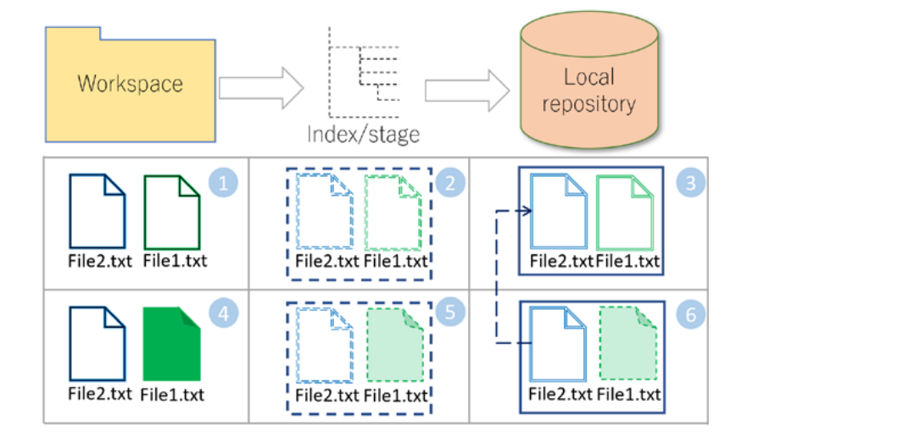
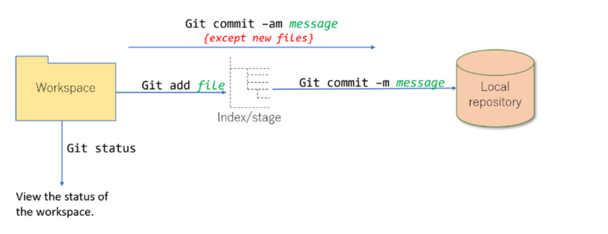
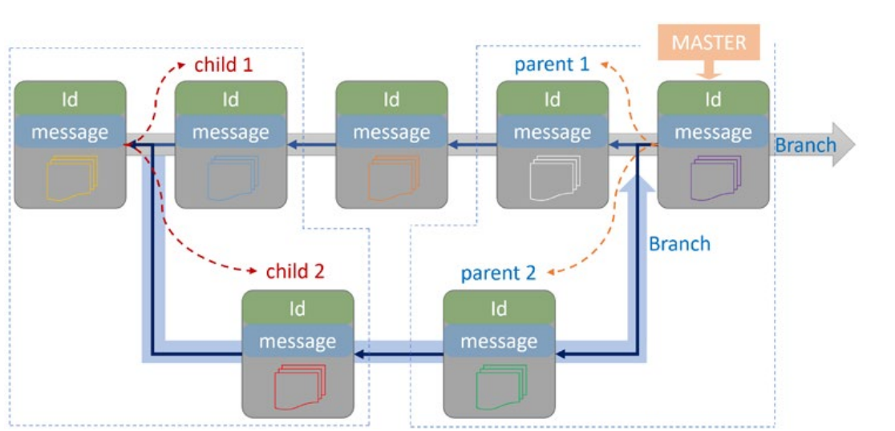
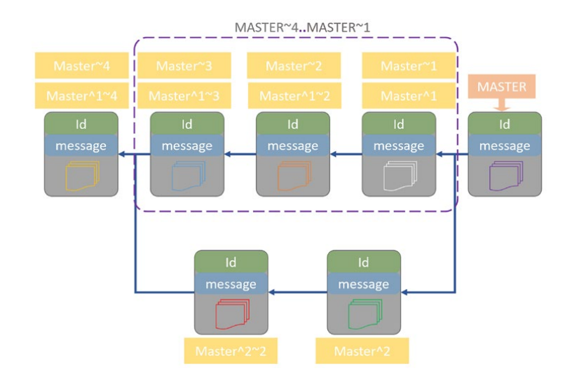

# Introduction
* Git is a free and open source tool for tracking changes, sharing source code and documents, preparing backups and collabration between team members.
* Git was created by `Linus Torvalds` for the development of the Linux Kernel and its has been extended to all the main stream of software development.
* if you are on `windows` download and install [GIT Bash](https://gitforwindows.org/) and on `Mac use the brew package manager` or on `Linux use the distributed package manager like apt, yum` and also `git is mostly automatically installed on mac and linux pc` so don't worry.
* Will also recommend you to register or sign up account on [GIT HUB](https://github.com) since is the most popular remote server for storing source code.
* You can use git with a graphical interface but complex situations can't be magically solved with GUI, so is useful for us to understand and learn git the hard way with command line interface. 
* `A Git command has special semantics`
```bash
git + command + parameters
```
It starts with the `git` keyword, then the `command name` follows and then `parameters` come after. All git commands are documented online or get it with the `-- help` parameter on the terminal. eg `git init --help`

## Initialiing a Repository 
Simply create a folder or dictory we want to place our git repo (As in where our repository will live.) `Git folders are technically called repository but they are just dictory or folder with files in it`
* Let create a folder called `grace with mkdir command` using  `git bash on windows and normal terminal on mac or linux` and let move into the `grace folder with cd command` and finally initialize our git repo called `step1`
```bash
$ mkdir grace
$ cd grace
$ git init step1
```
The last command create a folder called `step1` and initialize a git repository inside it and now `step1` becomes our `workspace`  

* Git create a new hidden directory called `.git` which handles all the magic but we look at git internals latter when we become experience with the git surface. For now think of `.git` as a database that record all the changes that will happen in our `step1` folder or dictory. you can view the step folder with `ls -la` command, where the `a` option helps to show all the hidden files and `l` option to display it vertical.
* `.git folder is automatically created by git to track all changes made in step1 folder`


Git monitors the contents of the workspace and stores changes in `two stages`
* `First stage` Git detects changes like `create, update or modify. delete, copy or move` that happens to files in the step1 folder and make a list of all changed files, then the software engineer select a portion or all the list files for git to add it to a `staging area` also called `indexing or cache` area which a temporary place for git to remember changes in files and only most updated version will e rememered since previous copy will get override. `Think of the staging area as proposing to a woman with sweet words in text message form, you can make chages to this words or even delete it and start again` 
* `Second stage` stores a snapshot of files at each moment in time. That is git will move every files rembered at the staging area to a permanent storage database called `local repository`. `Think of the snapshot as the moment you press the send button for the message to be sent to her and now the message is permanently stored on your phone message inbox`


Git is very efficient with using storage space. It applies efficient methods for compressing and avoiding repetitive copies of files and also in git files are stored as they are.
* `Let practice using markdown`
* 1. `ex1.md` and `ex2.md` are created in `step1 workspace` and being `staged` in the `staging or index or cachedd area`
* 2. And finally being stored or committed in the `local repository`   
* 3. Later only `ex1.md` is updated or modified in the `workspace`
* 4. Then its `staged`
* 5, 6. If we ask Git to select all the files in the `stagging area` and store them into `local repository`, as `ex1.md` is changed, its updated version is saved into `local repository` but `ex2.md` is not changed, so to save space git create a `pointer to the previous copy` of `ex2.md`. This `pointer` and updated copy of `ex1.md` are stored in the `local repository`
*  In this way Git avoids replicating unmodified files and saves storage.

`(1) ex1.md and ex2.md are created, staged (2), and
then stored in the local repository (3). ex1.md is updated (4) and
then staged (5). The updated stage area contents are stored into the
local repository (6). File1.txt is physically updated and a fresh copy
is saved into local repository; however, ex2.md did not change, so a
pointer to the previous copy is placed in the last commit-instead of
replicating ex2.md`


## Practing inside the workspace on the terminal
```bash
$ touch ex1.md ex2.md # how we create file or files on the command line
$ git status
$ git add ex1.md # stagging only ex1.md file in this workspace 
$ git add . # stagging all files in this workspace 
$ git commit -m "Added example 1 and 2" # how git stores files into local repostory
$ git status  # how git detects changes
```


## Looking Inside the Stagging Area
```bash
$ git ls-files # shows files names and their paths
$ git ls-files --stage # shows files and their ids
$ git show (first five or seven ids) # show the file contents (mode - unique id and file name)
$ git rm --cache (path file) # to untrack or remore a file from the staging area
```
## Delete a File
* Git reposirories are sensitives and their contents should be modified under `Git supervision`, specially deleting a files. 
* Example if we delete a with rm command eg: `rm ex1.md` from the workspace 
*  Git noticed `ex1.md` was removed from the workspace, however is still in the staging area and can check with the `ls-files` command
*  The deleted files are also required to be removed from the stagging area. so after deleting a file from the workspace. we need to add this change to the stagging area and then commit it into the local respository.
```bash
$ rm ex1.md
$ git ls-files
$ git add .
$ git status
$ git commit -m "deleted example 1 file"
```
* Instead of removing a file from the workspace and stage area separately, Git has a remove command that deletes resources from both places at once. The remove command deletes a file from stage area and workspace.
However, we still need to save this change in the local repository.
```bash
$ git rm ex1.md # for deleting a single file
$ git rm -rf foo # for deleting a folder or dictory 
```

## Rename and Relocate a File
In Git renaming afile is the same as relocating it and is done with the `git mv` command. `The move command needs two parameters: the first one is a path to the source file, and the second parameter is the destination file`.
* Rename or relocate the target file inside the workspace
* Add the changes to the stage area
* Commit into the local repository content
`Note: The mv command works only for files that are already staged. Trying to rename or relocate a file that does not exist in the stage area would raise error`
```bash
$ git mv ex1.md ex5.md
$ git mv ex4.md ./docs/ex4.md
$ git mv template ./docs/
$ mv -f log/* docs/ # need to move all content and also create a directories that does not exit
$ git status --short # checking the result
```
* The D in front of the file’s name indicates that the file is deleted, and ?? indicates that the doc directory is not tracked yet (is not available in the stage area). We need to add these changes into the stage area such that Git notices the files are renamed/relocated (not deleted)

## Ignore a File
Git is sensitive to all changes happening inside the workspace. However, sometimes we may not be interested in tracking some files or contents of a directory like temporary documents or log files. 
* The gitignore feature lets us pass over unwished files by creating a `.gitignore` file to includes a list of files and dictories to be ignored.
* To activate the ignore list, we add the file into the stage area and commit it into the local repository:
```bash
$ touch .gitignore
$ git add .
$ git commit -m "added .gitignore file"
$ ls -R
```
`Note: ex.md is included inside the .gitignore file after we added File1.txt into the stage area. As ex.md is included in .gitignore, we expect all changes to the
file are ignored. To evaluate this, we add a new line to File1.txt and check the status. If everything were as we expected, then changes on ex.md would be ignored. Although ex.md is included in the .gitignore list, the changes are still tracked. For situations like this, to enforce Git to consider the newer version of .gitignore, we need to remove the disinterested files from the
stage area, like (git rm --cache ex.md) but the remove command (rm) with the --cache parameter deletes a
file from the stage area. If the workspace content does not match with the stage area, we need to use the -f (force) parameter to remove a file forcefully (git rm -f --cache ex.md)`

## Inside a Repository
* Each commit inside the repository has a unique Id,human-readable label, and one or more parents and children.

* Git uses pointers to manage the organization of the branches and commits. We can use these pointers to access a specific point in the history of commits.
* There are two types of pointers:
*  The first type are `automatic pointers`. These pointers are constructed automatically by Git and used for managing branches. The most useful pointers in this category are `branch pointers` and `HEAD pointers`.`Branch pointers` always point to the `last commit` on a
branch, so when a `new commit` is inserted into a branch, the `branch pointer` is automatically updated to point to the `new commit`. Git uses a `HEAD pointer` to mark the current active branch. In contrast to the `branch pointers`, which are `fixed` on the `last commit`, we can reposition `HEAD` to `any commit` on `any branch` and also  we can `create other branches`, but at each point in time, we are allowed to position on only one of the branches.
* The second type of pointers are labels
* We can `create labels` for commits of interest such that instead of using their Ids, we can use labels to access them.
* To access a commit, we can use `absolute or relative addressing`.
* In absolute addressing we can switch on a commit using its `Id`. 
* In relative access, the commit position relative to an already `known pointer` is used. 
* The relative access is `very common`, and a `special syntax` is developed for it.
* Examples
* The tilde operator `~` indicates a commit relative to the specific point on the same branch.
*  The left side of the operator is the target pointer.
* The right side is the number of commits before the target point.
* `Main~1`: One commit before Main
* `Main~3`: Three commits before Main
* Generally `Pointer~n`: `nth commit before Pointer`
* We can also use the absolute address of a commit, (`6ca0867~2` means two commits before the commit with `Id 6ca0867`)
* Commits could have `multiple parents`. 
* This happens when `two or more branches` are `merged`. * We can specify the parent we need by using the caret
operator `^`.
* `Main^1`: First parent of the commit that Main points
* `Main^2`: Second parent of the commit that Main points
* General `Pointer^n`: `nth parent of Pointer`
* The double dot `..` is a range operator. 
* It returns the commits in between the `selected range`
* `Main~4..Main~1`: Selects commits in between four commits ahead of Main (not including the
fourth one) and the one before Main.


## Log History